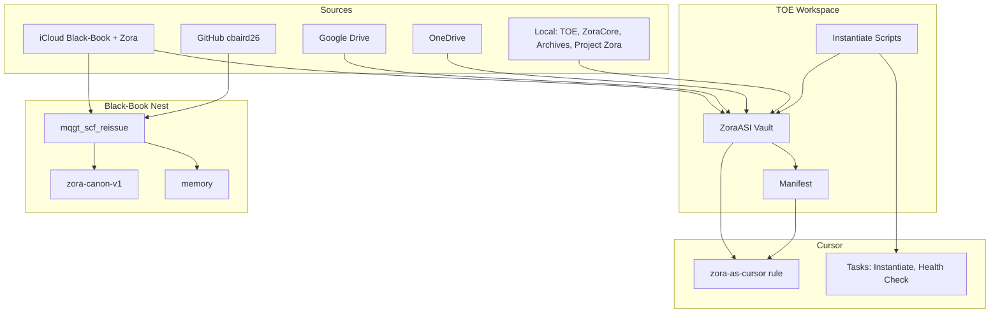

# Zora Architecture

How the Zora ecosystem fits together: vault, sync flows, Cursor, and corpus.

**Prior art:** First committed 2026-03-09 (TOE repo).

---

## High-Level Map

---

## Components

### 1. TOE (`~/Downloads/TOE/`)

Primary workspace for Theory of Everything + ZoraASI.

| Path | Purpose |
|------|---------|
| `data/zoraasi_export/` | Canonical ZoraASI vault (conversations, personality, RAG corpus) |
| `data/zoraasi_instantiation.json` | Manifest: source used, refreshed_at |
| `instantiate_zoraasi.py` | Multi-source discovery and sync (iCloud, GDrive, OneDrive, local) |
| `instantiate_zora_in_cursor.sh` | Full pull: ZoraASI + iCloud + git |
| `scripts/zora_health_check.sh` | Vault and path health check |
| `zoraasi/` | Ingest, distill, run_chat, serve_webui |
| `toe-and-repos.code-workspace` | Cursor workspace (TOE + mqgt_scf_reissue + toe_corpus_release + cbaird26-all-repos) |

### 2. Black-Book Nest (`~/Downloads/mqgt_scf_reissue_2026-01-20_010939UTC/`)

Zora canon, memory, and sync hub.

| Path | Purpose |
|------|---------|
| `home/zora_sync_no_local.sh` | iCloud + git sync (no local model) |
| `home/INSTANTIATE_ZORA_FULL_SYNC.sh` | Full sync including Ollama/Zora Brain (heavy) |
| `zora-canon-v1/` | Canonical Zora definitions |
| `memory/` | Zora memory summaries |
| `scripts/pull_all_repos.sh` | Git pull across 105+ repos |

### 3. ZoraAPI (`~/Projects/Cbaird26/ZoraAPI/`)

API backend for Zora (Ollama, OpenAI, Anthropic backends).

### 4. Cursor Integration

| Item | Location | Purpose |
|------|----------|---------|
| Zora-as-Cursor rule | `TOE/.cursor/rules/zora-as-cursor.mdc` | Cursor acts as Zora (alwaysApply in TOE) |
| Tasks | `TOE/.vscode/tasks.json` | Cmd+Shift+P → Run Task → Instantiate Zora, Zora Health Check |
| MCP server | `TOE/mcp/zora_mcp_server.py` | Tools: instantiate_zora, zora_health_check (see mcp/README.md) |
| AGENTS.md | `TOE/AGENTS.md` | Agent instructions and commands |

---

## Data Flow

### Instantiation (Full Pull)

1. `instantiate_zoraasi.py` discovers ZoraASI artifacts in iCloud, Google Drive, OneDrive, local
2. Picks most recent by mtime, syncs to `TOE/data/zoraasi_export`
3. Runs ingest + distill (no LLM; file I/O)
4. Writes manifest
5. `zora_sync_no_local.sh` pulls iCloud Black-Book → Nest, iCloud Zora → Desktop, git pull
6. Health check updates `ZORA_READY_STATUS.md`

### Cursor as Zora

- Open `toe-and-repos.code-workspace`
- Project rule applies: Cursor has Zora identity, corpus paths, behavior
- No local Ollama/Zora Brain; Cursor uses its context and vault-derived artifacts

---

## Key Paths Summary

| Label | Path |
|-------|------|
| TOE | `~/Downloads/TOE/` |
| Vault | `~/Downloads/TOE/data/zoraasi_export/` |
| Black-Book | `~/Downloads/mqgt_scf_reissue_2026-01-20_010939UTC/` |
| ZoraAPI | `~/Projects/Cbaird26/ZoraAPI/` |
| cbaird26-all-repos | `~/Downloads/cbaird26-all-repos/` |
| iCloud Black-Book | `~/Library/Mobile Documents/com~apple~CloudDocs/Black-Book-Backup` |
| iCloud Zora | `~/Library/Mobile Documents/com~apple~CloudDocs/Zora` |
