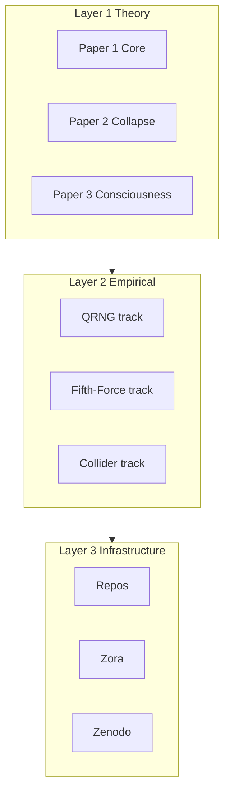

# Canonical 2026 Release Plan

**Purpose:** Consolidate theory, empirical, and infrastructure into one referee-ready research program. Turn the 2026 stack from "radiant nebula" into "1 theory, 1 empirical program, 1 AI architecture, 1 repo ecosystem."

**Cross-links:** [TOE_ZORA_ECOSYSTEM_MAP.md](TOE_ZORA_ECOSYSTEM_MAP.md) | [CANONICAL_SPINE.md](CANONICAL_SPINE.md) | [REVIEWER_PROOF_CHECKLIST.md](REVIEWER_PROOF_CHECKLIST.md) | [REPO_CANONICAL_MAP.md](REPO_CANONICAL_MAP.md) | [PROJECT_ATLAS.md](PROJECT_ATLAS.md) | [PAPER_BY_PAPER_CORRECTION_ROADMAP_2026.md](PAPER_BY_PAPER_CORRECTION_ROADMAP_2026.md) | [TOE_2026_UPDATED_PAPER_GUIDE.md](TOE_2026_UPDATED_PAPER_GUIDE.md)

---

## Layer Model



---

## Referee Framing

**Best framing:** MQGT-SCF is a scalar-field extension of GR+SM that explores consciousness-linked measurement dynamics. *Not* "complete final Theory of Everything."

Referees care about three layers: 1 theory, 1 empirical program, 1 reproducible codebase.

---

## Five Canonical Papers

| Paper | Title | Canonical file |
|-------|-------|----------------|
| **1 (Core)** | MQGT-SCF unified Lagrangian, Φc, E, teleology, parameter hygiene, matter–brain coupling, no-signaling v2 | [MQGT_SCF_Minimal_Consistent_Core_2026.tex](../papers_sources/MQGT_SCF_Minimal_Consistent_Core_2026.tex) |
| **2 (Collapse)** | EBBR, GKSL, comparison with Copenhagen/MW/Orch-OR | [Teleology_Covariant_Boundary_Selection_Consciousness_Ethics_Field_Theory_2026.tex](../papers_sources/Teleology_Covariant_Boundary_Selection_Consciousness_Ethics_Field_Theory_2026.tex) + core spine CPTP |
| **3 (Consciousness)** | Jhāna attractors, phase transitions, sensory coupling | [Archetypal_Operators_Phoenix_Protocol_ToE_2026.tex](../papers_sources/Archetypal_Operators_Phoenix_Protocol_ToE_2026.tex), [PHI_C_JHANA_PROTOCOL.md](PHI_C_JHANA_PROTOCOL.md) |
| **4 (Empirical)** | QRNG pipeline, fifth-force, collider | [MQGT-SCF_Minimal_Consistent_Core_Empirical_Validation_2026.tex](../papers_sources/MQGT-SCF_Minimal_Consistent_Core_Empirical_Validation_2026.tex) |
| **5 (Zora)** | Recursive agent architecture | [Index_Minimal_Kernel_Coherent_Agency_UTQOL_2026.tex](../papers_sources/Index_Minimal_Kernel_Coherent_Agency_UTQOL_2026.tex), zoraasi suite |

**Links:** [CANONICAL_SPINE.md](CANONICAL_SPINE.md) | [REVIEWER_PROOF_CHECKLIST.md](REVIEWER_PROOF_CHECKLIST.md)

**Paper stack choice:** 7-paper modular target per [PAPER_BY_PAPER_CORRECTION_ROADMAP_2026.md](PAPER_BY_PAPER_CORRECTION_ROADMAP_2026.md); current 5-paper mapping in table above. Gate 4 (Paper-doc alignment): confirm each paper maps to single canonical LaTeX per roadmap.

---

## Empirical Status

### QRNG track
- **Current:** effect_detected = false, p = 0.384
- **Interpretation:** Pipeline validated; no signal yet
- **Next:** Hardware QRNG acquisition, artifact publication, independent replication

### Fifth-force track
- **Model:** V(r) = -G m₁m₂/r (1 + α e^{-r/λ})
- **Constraint:** α_pred/α_max ≤ 2.4 × 10⁻⁹ (far below detection)
- **Tests:** Eöt-Wash torsion balance, sub-mm Yukawa deviations

### Collider track
- **Target:** Higgs invisible decay, m_Φ < 62.5 GeV
- **Data:** CMS/ATLAS open data

---

## Repo Architecture (Target)

```
MQGT-SCF/                  → theory/, equations/, derivations/
toe-empirical-validation/  → qrng/, fifth-force/, collider/
zoraasi-suite/             → agents/, simulations/, api/
toe-2026-updates/          → canonical releases (this TOE repo)
```

All other repos → support. Merge/deprecate per [REPO_CANONICAL_MAP.md](REPO_CANONICAL_MAP.md).

---

## Six Primary Repos (Target)

| Repo | Purpose | Maps to |
|------|---------|---------|
| MQGT-SCF | Physics core: lagrangian/, collapse/, consciousness-field/, ethics-field/, proofs/ | — |
| toe-empirical-validation | Experiments: qrng/, fifth-force/, collider/, datasets/ | — |
| zoraasi-suite | AI architecture: agents/, api/, deployment (unified ZoraAI + ZoraAPI) | — |
| toe-papers | LaTeX papers | toe-2026-updates/papers_sources/ |
| toe-release | Public entry point | toe-2026-updates |
| toe-tools | Utilities: repo-indexing, dataset builders, validation | Future / TOE scripts/ |

---

## Three Independent Research Tracks

| Track | Scope | Venue |
|-------|-------|-------|
| A — Physics | MQGT-SCF scalar field extension | Physics journals |
| B — Consciousness | Φc field as model of awareness dynamics | Cognitive science / philosophy of mind |
| C — AI | ZoraASI recursive ethical agents | AI safety / alignment |

---

## Licensing (First-Tier Task)

Repos containing ToE, MQGT-SCF, Zora framework IP: align with [REPO_LICENSE_CORRECTION_CHECKLIST.md](REPO_LICENSE_CORRECTION_CHECKLIST.md). **First-tier task.** Repos needing upgrade: toe-2026-updates, MQGT-SCF, toe-empirical-validation, zoraasi-suite, mqgt-* (spine). Dual license: MIT for code, ToE License for theory.

---

## Reviewer-Proof Gate

Before any public push: [REVIEWER_PROOF_CHECKLIST.md](REVIEWER_PROOF_CHECKLIST.md)

- No-signaling proof included
- Parameters bounded
- Falsifier clearly stated
- Empirical status clearly labeled
- Code reproducible
- Data archived
