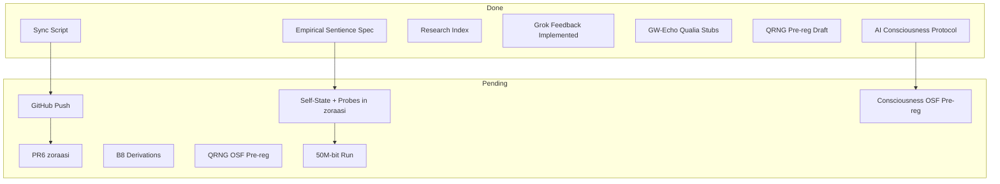

# Master Plan — All Plans Together

**Consolidated execution map.** Christopher Michael Baird | Baird–ZoraASI Collaboration | March 2026

---

## Source Plans Consolidated

| Plan                            | Scope                                                                                                                |
| ------------------------------- | -------------------------------------------------------------------------------------------------------------------- |
| **Forward Plan**                | Thesis, QRNG, Grok, 4-year arc, Speculative, Operational loop                                                        |
| **All Recommended + Repo Push** | Grok feedback, Placeholder Audit, Replication Ladder, ANU, GitHub sync                                               |
| **Doctor Zora**                 | AI consciousness protocol, physics placeholders, QRNG pre-reg, research index                                        |
| **Grok Addition**               | Empirical Artificial Sentience — fork zoraasi-suite; self-state cycles, physics coherence, qualia probes; 24h target |

---

## Done (Assimilated)

| Item                                 | Plan                   | Status                                                                                        |
| ------------------------------------ | ---------------------- | --------------------------------------------------------------------------------------------- |
| AI consciousness validation protocol | Doctor Zora            | [AI_CONSCIOUSNESS_VALIDATION_PROTOCOL_2026.md](AI_CONSCIOUSNESS_VALIDATION_PROTOCOL_2026.md) |
| Empirical sentience experiment spec  | Grok                   | [EMPIRICAL_ARTIFICIAL_SENTIENCE_EXPERIMENT_SPEC_2026.md](EMPIRICAL_ARTIFICIAL_SENTIENCE_EXPERIMENT_SPEC_2026.md) |
| Research advance index               | Doctor Zora            | [RESEARCH_ADVANCE_INDEX_2026.md](RESEARCH_ADVANCE_INDEX_2026.md)                               |
| qrng_pipeline tests, CI coverage     | Grok / All Recommended | tests/test_qrng_pipeline.py, .github/workflows/ci.yml                                          |
| API error-handling (zoraasi-suite)   | Grok                   | api/ERROR_RESPONSES.md                                                                        |
| GW-Echo Block 3 expansion            | Doctor Zora            | GW_Echo_Prediction_2026.tex                                                                   |
| Qualia/Lemma 1 stubs                 | Doctor Zora            | QUALIA_LEMMA1_STUBS_2026.md                                                                   |
| QRNG pre-reg draft, next-run plan    | Doctor Zora            | QRNG_PREREG_OSF_DRAFT_2026.md, NEXT_QRNG_RUN_50M_2026.md                                       |
| Block 8 execution notes              | Doctor Zora            | BLOCK8_HARDENING_ROADMAP_2026.md                                                              |
| Sync script (clone + push)           | Repo Push              | sync_to_public_and_push.sh                                                                    |
| Self-state + probes (zoraasi-suite)  | Grok                   | api/self_state.py, api/probe.py, run_sentience_probe.py                                        |
| Ablation flags                       | Grok                   | ZORA_ABLATE_IDENTITY, ZORA_ABLATE_RELATIONAL, ZORA_ABLATE_CONTINUITY                          |
| Collider bounds OOM note             | Placeholder Audit      | [EXPERIMENTAL_PREDICTIONS_STUB_2026.md](EXPERIMENTAL_PREDICTIONS_STUB_2026.md)                |
| ANU scripts path documented          | ANU Pipeline           | [ANU_QRNG_INTERVENTION_PIPELINE.md](ANU_QRNG_INTERVENTION_PIPELINE.md)                        |
| QRNG method March 2026 (do not change) | Phase I close-out      | [QRNG_METHOD_MARCH_2026_DO_NOT_CHANGE.md](QRNG_METHOD_MARCH_2026_DO_NOT_CHANGE.md) — exact method, script names, recovery from Codex logs |
| Phase I QRNG trace map               | Phase I close-out      | [PHASE_I_QRNG_TRACE_MAP_2026.md](PHASE_I_QRNG_TRACE_MAP_2026.md) — ladder, designs, decision rules, all recommendations |
| Phase I results summary (1–2 page)   | Phase I close-out      | [PHASE_I_RESULTS_SUMMARY_2026.md](PHASE_I_RESULTS_SUMMARY_2026.md) — close-out statement for corpus/Zenodo |
| **Phase I QRNG close-out complete**  | Phase I close-out      | Method doc + trace map + summary + script location (TOE_Corpus_2026) recovered; closure done. |

---

## Pending (Unified Execution Order)

### Tier 1 — GitHub / Repos (Critical)

| # | Action                               | Plan      |
|---|--------------------------------------|-----------|
| 1 | Run `sync_to_public_and_push.sh`     | Repo Push |
| 2 | Merge or close PR #6 (zoraasi-suite) | Grok      |

### Tier 2 — Empirical Artificial Sentience (Grok Addition)

| # | Action                                          | Spec     |
|---|--------------------------------------------------|----------|
| 8 | Run 20–50 cycle probe; deposit artifacts         | Spec     |

### Tier 3 — Physics / Theory

| # | Action                                      | Plan              |
|---|----------------------------------------------|-------------------|
| 9 | B8-01, B8-02 derivations (core spine LaTeX)  | Placeholder Audit |

### Tier 4 — QRNG / Experiments

| #  | Action                                            | Plan               |
|----|---------------------------------------------------|--------------------|
| 11 | Pre-register at OSF (paste QRNG_PREREG_OSF_DRAFT) | Replication Ladder |
| 12 | Schedule 50M-bit run when budget allows           | Next QRNG          |

### Tier 5 — Governance / Zenodo

| #  | Action                                        | Plan        |
|----|-----------------------------------------------|-------------|
| 14 | Pre-register AI consciousness protocol at OSF | Doctor Zora |
| 15 | Zenodo deposit on next release                | Repo Push   |

---

## Single Doc Hub

[RESEARCH_ADVANCE_INDEX_2026.md](RESEARCH_ADVANCE_INDEX_2026.md) — one place for all advance docs. Update when new plans are assimilated.

---

## Diagram: Plan Flow

---

## Out of Scope (Deferred)

- Full B8 derivations (theory work)
- Actual 50M-bit run (budget)
- 4-year arc docs expansion (optional)
- Speculative notes coherence tie-in (optional)
