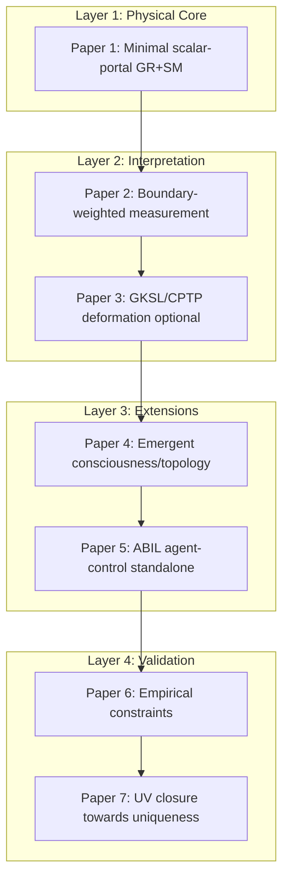

# Paper-by-Paper Correction Roadmap (2026)

**Purpose:** Master correction index for the ToE/MQGT-SCF publication stack. Maps each paper to scope, canonical file, corrections to apply, and status. Aligns with the 7-paper modular target architecture and the transcript-derived recommendations.

**Cross-links:** [CANONICAL_2026_RELEASE_PLAN.md](CANONICAL_2026_RELEASE_PLAN.md) | [TOE_2026_UPDATED_PAPER_GUIDE.md](TOE_2026_UPDATED_PAPER_GUIDE.md) | [REVIEWER_PROOF_CHECKLIST.md](REVIEWER_PROOF_CHECKLIST.md) | [PHYSICS_ONLY_SUBMISSION_PACKET_2026.md](PHYSICS_ONLY_SUBMISSION_PACKET_2026.md) | [NOTATION_GLOSSARY_2026.md](NOTATION_GLOSSARY_2026.md)

---

## 7-Paper Target Architecture

---

## Paper Map

| Paper | Scope | Canonical file | Corrections to apply | Status |
|-------|-------|----------------|----------------------|--------|
| **1** | Ultra-minimal GR+SM + two portal scalars (φ, χ); no Φc/E interpretation | [Paper1_Minimal_Scalar_Portal_GR_SM_2026.tex](../papers_sources/Paper1_Minimal_Scalar_Portal_GR_SM_2026.tex) (Path A) or [MQGT_SCF_Minimal_Consistent_Core_2026.tex](../papers_sources/MQGT_SCF_Minimal_Consistent_Core_2026.tex) (Path B) | Decoupling limit explicit; stability conditions; falsifier table; conservative abstract | Pending |
| **2** | Teleology as boundary/measure tilt | [Teleology_Covariant_Boundary_Selection_Consciousness_Ethics_Field_Theory_2026.tex](../papers_sources/Teleology_Covariant_Boundary_Selection_Consciousness_Ethics_Field_Theory_2026.tex) + Core Sections 4–5 | Align to boundary functional P(α) form; no local bulk teleology term | Pending |
| **3** | GKSL/CPTP; kill criterion if not no-signaling | Core Section 3 | Ensure CPTP/no-signaling explicit; retire deformation if not provably no-signaling | Pending |
| **4** | Emergent consciousness/topology (or choose scalar vs topological ontology) | [Archetypal_Operators_Phoenix_Protocol_ToE_2026.tex](../papers_sources/Archetypal_Operators_Phoenix_Protocol_ToE_2026.tex) | Decide: minimal singlet scalar or richer geometric field; topology emergent unless upgraded | Pending |
| **5** | ABIL agent-control standalone | [Asimov_Baird_Invariance_Laws_ABIL_2026.tex](../papers_sources/Asimov_Baird_Invariance_Laws_ABIL_2026.tex) | **Excluded from physics-only packet.** Publish as AI safety / controls paper | Pending |
| **6** | Empirical constraints | [MQGT-SCF_Minimal_Consistent_Core_Empirical_Validation_2026.tex](../papers_sources/MQGT-SCF_Minimal_Consistent_Core_Empirical_Validation_2026.tex) | Falsifier table center of gravity; one posterior, one model ladder | Pending |
| **7** | UV closure towards uniqueness | [overleaf/MQGT_SCF/uniqueness.tex](../papers_sources/overleaf/MQGT_SCF/uniqueness.tex) | **Candidate routes only**—relabel as "towards uniqueness"; not demonstrated | Pending |

---

## Physics-Only Packet: Included vs Excluded

**Included (Papers 1, 2, 3, 4, 6):** Minimal core, measurement/teleology, collapse, consciousness (if scalar-only), empirical.

**Excluded (Papers 5, 7 for headline claims):** Paper 5 (ABIL/Zora) — AI track, separate venue. Paper 7 — UV/uniqueness as conjecture, not decisive for referee.

---

## Link to REVIEWER_PROOF_CHECKLIST

| Checklist item | Relevant papers |
|----------------|-----------------|
| 1) Canonical spine integrity | All |
| 2) Theorem completeness (no-signaling) | 2, 3 |
| 3) Ethics operationalization | 2 |
| 4) Parameter hygiene and bounds | 1, 6 |
| 5) Flagship falsifier quality | 1, 6 |
| 6) Matter/brain coupling canonicalization | 1, 4 |
| 7) Reproducibility | 6 |
| 8) Final release gate | All |

---

## Uniqueness Clarification

Paper 7 and any "uniqueness proof" language: **relabel as "towards uniqueness" or "candidate UV completion routes."** Full uniqueness is not demonstrated; the agenda is a constraint-based research program, not a theorem.

---

## Path A vs Path B

- **Path A:** Create new [Paper1_Minimal_Scalar_Portal_GR_SM_2026.tex](../papers_sources/Paper1_Minimal_Scalar_Portal_GR_SM_2026.tex) as ultra-minimal referee entry point. Current Core becomes combined Papers 2+3.
- **Path B:** Harden existing Core as Paper 1 (combined physics + measurement). Add falsifier table, conservative abstract, decoupling subsection. Ultra-minimal split deferred.

Current implementation: **Path B** (harden Core). Path A skeleton available as optional future work.

---

## Reviewer-proof pass (2026-03-11)

After implementing this correction program, the following REVIEWER_PROOF_CHECKLIST items were addressed:

- **4) Parameter hygiene:** Core has parameter table; falsifier table added to Core and FALSIFICATION_PACKET.
- **5) Flagship falsifier:** Falsifier table (quantity | current bound | threshold) added; interferometric Γ is flagship.
- **8) Internal consistency:** Notation subsection and NOTATION_GLOSSARY_2026.md disambiguate E vs trajectory cost.
- **Uniqueness:** Relabeled as "towards uniqueness" in uniqueness.tex, CORE_FORMALISM, overleaf README.
- **Zora separation:** Paper 5 (ABIL) explicitly excluded from physics-only packet.

**Remaining for manual sign-off:** Run full [REVIEWER_PROOF_CHECKLIST.md](REVIEWER_PROOF_CHECKLIST.md) before submission. Verify theorem package (2), ethics operationalization (3), reproducibility (7), and final release gate (8) against current corpus.
