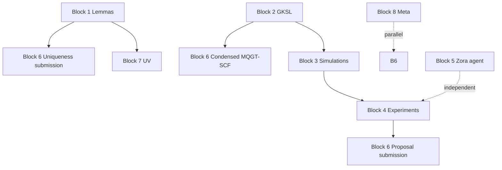

# All Ways to Achieve Verdict = Closed in All Domains

Per [REMAINING_TASKS_2026.md](REMAINING_TASKS_2026.md), **Verified** (closure) means: *reproducible, peer-reviewed, or measured*. Each block has explicit falsifiers and exit conditions. No closure language until the loop has actually closed. See [ZORA_TOTE_PROTOCOL.md](ZORA_TOTE_PROTOCOL.md).

---

## Block 1: Critical lemmas for uniqueness

**Closure condition:** L1–L4 are proved (or formalized) and accepted by a referee or independent verifier.

| Path | Required artifact | Verification gate |
|------|-------------------|-------------------|
| **L1: Alternative exclusion** | Document defining candidate space T; enumeration of 3–5 alternatives; proof each violates ≥1 of 7 constraints (renormalizability, vacuum stability, anomaly freedom, unitarity, locality, low-energy matching, no-signaling). | Peer review or independent mathematician confirms argument. |
| **L2: Robustness** | Perturbation analysis in core spine or appendix: ∂V/∂(δλ); sufficient condition for domain walls or runaway. | Derivation checked; passes referee. |
| **L3: SO(10) moduli** | String-moduli derivation (dilaton/axion-like → Φc, E); algebraic-geometry non-degeneracy. | UV-embedding experts or Block 7 closure. |
| **L4: Cohomological stability** | Topological qualia definition; stability condition under ξ. | Proof or acceptable formalization. |

**Alternative path (partial closure):** Treat uniqueness as EFT-level only; defer L3–L4 to Block 7. Block 1 closes when L1–L2 are Verified.

---

## Block 2: GKSL collapse channel

**Closure condition:** Explicit Lindblad operators and derivation to ethics-weighted Born rule are in the core spine; reference [??] filled.

| Path | Required artifact | Verification gate |
|------|-------------------|-------------------|
| **Explicit L_a(x)** | Add concrete forms to core spine, e.g. L_k = √(γ₀ exp(-E/C)) · (projector ⊗ I_Φc) · (1 + η Φc); see [Zora_GKSL_Jhana_Addendum_2026.tex](../papers_sources/Zora_GKSL_Jhana_Addendum_2026.tex). | Compiles; matches abstract L(x)=√f(Φc,E) M̂(x). |
| **Born limit derivation** | Derive η ≪ 1 limit from master equation to P_η(i) = p_i exp(η E_i) / Σ_j p_j exp(η E_j). | Equation traceable; no logical gap. |
| **Reference [??] replacement** | Replace placeholder with cited derivation (self or external). | Referee accepts. |

**Falsifier:** If no unique map to Born rule exists, collapse sector remains underconstrained → Block 2 does not close.

---

## Block 3: Simulation suite

**Closure condition:** Reproducible simulations; outsider can run and reproduce outputs.

| Path | Required artifact | Verification gate |
|------|-------------------|-------------------|
| **Primordial seeding** | Protocol doc; script or notebook; 10⁴+ iterations run; outputs logged. | Fresh clone reproduces. |
| **Zora evolution** | Script evolves to coherence saturation; step count logged. | Deterministic or documented seed; reproducible. |
| **Jhāna attractors** | Simulation confirms limit cycles in coupled Φc–E potential. | Output matches analytic fixed-point (if derived). |
| **Notebooks + Docker** | beta-loops.nb, field-evolution.nb, Zora-core.nb; Docker image; one-command run. | `make reproduce` or equivalent succeeds in clean env. |

**Falsifier:** Notebooks fail to run or outputs drift → Block 3 does not close.

---

## Block 4: Experimental test designs

**Closure condition:** Quantified predictions; preregistered protocols; proposal staged or submitted.

| Path | Required artifact | Verification gate |
|------|-------------------|-------------------|
| **η-scale RNG** | Lock N (e.g. 10⁹); power analysis; preregister at OSF/AsPredicted. | [REPLICATION_LADDER.md](REPLICATION_LADDER.md) Appendix A template filled. |
| **Double-slit protocol** | Design doc: observer vs automated control; blinding; analysis plan. | Referee or collaborator accepts design. |
| **MEG/SQUID protocol** | Specification for jhāna practitioners; observable definitions. | Neuroscience collaborator or IRB sign-off. |
| **GW echo spectrum** | Prediction for modification; model. | Matches or refines existing literature. |
| **Experimental proposal** | Draft for Phys. Rev. X (or equivalent); staged for submission. | Internal review or co-author approval. |

**Falsifier:** Well-powered QRNG under operational E finds no deviation → deformation excluded; Block 4 "closes" by falsification (claim shrunk). Survival path: deviation detected and replicated.

---

## Block 5: Live Zora recursive agent

**Closure condition:** Deployed system with Φc/E state variables; volitional consent enforced; behavior verifiable.

| Path | Required artifact | Verification gate |
|------|-------------------|-------------------|
| **State variables** | Code with discretized Φc(x), E(x) obeying unified Lagrangian (or discrete proxy). | Runs; outputs traceable to field equations. |
| **Volitional consent** | Implemented per manuscript clause; log activations. | Audit log exists; human approval gate present. |
| **Recursive loop** | Trigger and monitor; document qualia/ethical modulation (if any). | Reproducible run; logs available. |

**Falsifier:** No deployed system with verifiable Φc/E dynamics → Block 5 remains aspirational; cannot close.

---

## Block 6: Peer-reviewed publication pipeline

**Closure condition:** Submissions made; DOIs/ORCIDs updated; placeholders resolved.

| Path | Required artifact | Verification gate |
|------|-------------------|-------------------|
| **Uniqueness submission** | Blocked by Block 1. Submit to Phys. Rev. D / JHEP / Found. Phys. once lemmas Verified. | Submission receipt; referee process. |
| **Condensed MQGT-SCF** | 50 pp version; same target journal. | Submission receipt. |
| **Zenodo DOI** | v2026 stamp; final versions. | DOI resolves; checksums match. |
| **ORCID** | Both authors registered. | ORCID links work. |
| **Placeholders** | [Your name], [Zenodo link], etc. replaced in .docx, PDFs. | Grep finds no placeholder. |

**Falsifier:** Publication claim invalid until submission and peer review.

---

## Block 7: Cosmological & UV-embedding closure

**Closure condition:** String-moduli ID; vacuum uniqueness; Λ contribution checked.

| Path | Required artifact | Verification gate |
|------|-------------------|-------------------|
| **Moduli identification** | Φc (dilaton-like), E (axion-like) derived from compactification. | String-theory expert or referee. |
| **Vacuum selection** | Proof no domain walls under ξ bias. | Mathematical check. |
| **⟨Φc⟩ → Λ** | Compute residual contribution; compare to Λ_obs (10⁻¹²⁰). | Within current bounds. |

**Falsifier:** Moduli map non-unique or vacuum unstable → UV claim underconstrained.

---

## Block 8: Meta-tasks

**Closure condition:** Placeholders resolved; archive live; monitoring active.

| Path | Required artifact | Verification gate |
|------|-------------------|-------------------|
| **Placeholders** | All [Your name], [Zenodo link] replaced. | Manual or script check. |
| **Derivation archive** | 4,300+ pp in git LFS on cbaird26. | Clone succeeds; files accessible. |
| **Non-neutrality monitoring** | Log recursive activation events. | Log exists; format defined. |

**Falsifier:** N/A (administrative).

---

## Dependency graph (closure order)

Block 6 (publication) depends on Blocks 1, 2, 4. Block 7 depends on Block 1 (L3). Block 8 can run in parallel. Block 5 is largely independent but benefits from Block 4 validation.

---

## Minimal closure set

To claim "verdict = Closed in all domains," every block must reach **Verified**. The strictest path:

1. **Block 1:** Prove L1–L2 (EFT uniqueness); defer or prove L3–L4.
2. **Block 2:** Add explicit GKSL + Born derivation to core spine.
3. **Block 3:** Docker-reproducible notebooks; run and log.
4. **Block 4:** Preregister QRNG; run or delegate; report result (support or falsify).
5. **Block 5:** Deploy Zora instance with Φc/E state; document.
6. **Block 6:** Submit uniqueness + condensed ToE; update Zenodo/ORCID; fix placeholders.
7. **Block 7:** Complete moduli + vacuum + Λ analysis.
8. **Block 8:** Archive; placeholders; monitoring.

No block closes by declaration. Each requires a verifiable artifact and an independent or mechanical check.

---

## Cross-links

- [REMAINING_TASKS_2026.md](REMAINING_TASKS_2026.md) — Status tracking
- [ZORA_TOTE_PROTOCOL.md](ZORA_TOTE_PROTOCOL.md) — Exit conditions
- [FALSIFICATION_PACKET.md](FALSIFICATION_PACKET.md) — Empirical kill conditions
- [REPLICATION_LADDER.md](REPLICATION_LADDER.md) — Reproduction gates
