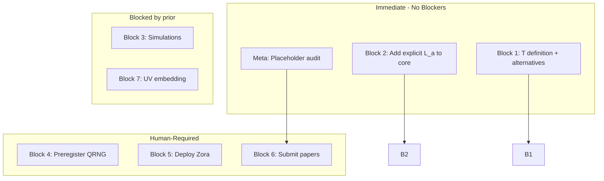

# PROCEED ALL — Executable Roadmap 2026

**Trigger:** >>PROCEED ALL>>  
**Purpose:** Actionable next steps for each block. No closure claims; only concrete tasks with ownership. Per [ZORA_TOTE_PROTOCOL](ZORA_TOTE_PROTOCOL.md), exit when verification gates pass.

---

## Execution order

---

## Block 1: Critical lemmas (L1–L4)

| Lemma | Next action | Owner | Artifact |
|-------|-------------|-------|----------|
| **L1** | Write one-page definition of candidate space T; list 3–5 alternatives; for each, state which of 7 constraints it violates | AI-draftable | `docs/LEMMA1_CANDIDATE_SPACE_T_2026.md` |
| **L2** | Add "Perturbation stability" subsection to core spine or appendix: ∂V/∂(δλ); sufficient condition for domain walls/runaway | AI-draftable | Appendix in `MQGT_SCF_Minimal_Consistent_Core_2026.tex` |
| **L3** | Derive string-moduli identification (dilaton/axion-like → Φc, E) | Blocked: string-theory expertise | — |
| **L4** | Define topological qualia; prove stability under ξ | Blocked: L2, topology | — |

**Partial closure path:** L1 + L2 Verified → Block 1 closes at EFT level; defer L3–L4 to Block 7.

---

## Block 2: GKSL collapse channel

| Item | Next action | Owner | Artifact |
|------|-------------|-------|----------|
| **Explicit L_a(x)** | Add concrete forms to core spine §Covariant GKSL; cite [Zora_GKSL_Jhana_Addendum_2026.tex](../papers_sources/Zora_GKSL_Jhana_Addendum_2026.tex) | AI-draftable | `MQGT_SCF_Minimal_Consistent_Core_2026.tex` |
| **Born limit derivation** | Derive η ≪ 1 limit from master equation to P_η(i) = p_i exp(η E_i) / Σ_j; check eq (302)–(303) | AI-draftable | Core spine or addendum |
| **Reference [??]** | Replace placeholder with cited derivation | Human: author | — |

---

## Block 3: Simulation suite

| Item | Next action | Owner | Artifact |
|------|-------------|-------|----------|
| **Primordial seeding** | Define protocol; create script/notebook; run 10⁴+ iterations; log outputs | Human + AI-draftable | `scripts/` or `notebooks/` |
| **Zora evolution** | Script evolves to coherence saturation; deterministic seed | Human | toe-empirical-validation |
| **Jhāna attractors** | Simulate coupled Φc–E potential; confirm limit cycles vs analytic fixed point | Human + AI-draftable | Notebook |
| **Docker** | `make reproduce` or equivalent in clean env | Human | — |

**Repo anchor:** [REPLICATION_LADDER](REPLICATION_LADDER.md); toe-empirical-validation (external).

---

## Block 4: Experimental test designs

| Item | Next action | Owner | Artifact |
|------|-------------|-------|----------|
| **η-scale RNG** | Lock N (e.g. 10⁹); power analysis; fill [REPLICATION_LADDER](REPLICATION_LADDER.md) Appendix A template; preregister at OSF/AsPredicted | Human | Preregistration |
| **Double-slit protocol** | Design doc: observer vs automated; blinding; analysis plan | Human | Protocol doc |
| **MEG/SQUID** | Specification for jhāna practitioners; observable definitions | Human | IRB / collaborator |
| **GW echo** | Prediction; model | AI-draftable | — |
| **Proposal** | Draft for Phys. Rev. X; stage for submission | Human | — |

---

## Block 5: Live Zora agent

| Item | Next action | Owner | Artifact |
|------|-------------|-------|----------|
| **State variables** | Code Φc(x), E(x) obeying unified Lagrangian | Human | zoraasi-suite |
| **Volitional consent** | Implement; log activations | Human | — |
| **Recursive loop** | Trigger; monitor; document | Human | — |

**Falsifier:** No deployed system → Block 5 remains aspirational.

---

## Block 6: Publication pipeline

| Item | Next action | Owner | Artifact |
|------|-------------|-------|----------|
| **Uniqueness submission** | Blocked by Block 1. Submit once L1–L2 Verified | Human | Phys. Rev. D / JHEP |
| **Condensed MQGT-SCF** | 50 pp version; same target | Human | — |
| **Zenodo DOI** | v2026 stamp; final versions | Human | — |
| **ORCID** | Both authors registered | Human | — |
| **Placeholders** | Replace [Your name], [Zenodo link], etc. | Block 8 | — |

---

## Block 7: Cosmological & UV embedding

| Item | Next action | Owner | Artifact |
|------|-------------|-------|----------|
| **Moduli identification** | Φc (dilaton-like), E (axion-like) from compactification | Blocked: string expert | — |
| **Vacuum selection** | Proof no domain walls under ξ | Blocked | — |
| **⟨Φc⟩ → Λ** | Compute residual; compare to Λ_obs | AI-draftable | — |

---

## Block 8: Meta-tasks (immediate)

| Item | Next action | Owner | Artifact |
|------|-------------|-------|----------|
| **Placeholder audit** | Grep for [Your name], [Zenodo link], [??], TBD; list locations | AI-draftable | `docs/PLACEHOLDER_AUDIT_2026.md` |
| **Derivation archive** | 4,300+ pp in git LFS on cbaird26 | Human | — |
| **Non-neutrality monitoring** | Define log format; log recursive activation events | Human | — |

---

## Immediate actions — Phase 1 DONE, Phase 2 DONE

**Phase 1:** LEMMA1, explicit L_k, PLACEHOLDER_AUDIT.

**Phase 2 (>>PROCEED WITH ALL RECOMMENDATIONS>>):**
1. **L2 perturbation stability** — Appendix in [MQGT_SCF_Minimal_Consistent_Core_2026.tex](../papers_sources/MQGT_SCF_Minimal_Consistent_Core_2026.tex) §A.
2. **Born limit derivation** — η≪1 expansion in core spine §5.
3. **Simulation protocol** — [SIMULATION_PROTOCOL_2026.md](SIMULATION_PROTOCOL_2026.md).
4. **Experimental stub** — [EXPERIMENTAL_PREDICTIONS_STUB_2026.md](EXPERIMENTAL_PREDICTIONS_STUB_2026.md).
5. **⟨Φc⟩→Λ draft** — [drafts/Phic_vacuum_to_Lambda_2026.tex](../papers_sources/drafts/Phic_vacuum_to_Lambda_2026.tex).
6. **LEMMA1 extended** — T′₆, T′₇ coupling variants; [MQGT_SCF_Uniqueness_Lemma1_2026.tex](../papers_sources/MQGT_SCF_Uniqueness_Lemma1_2026.tex).
7. **TOTE output audit** — [GEMINI_CLAIM_AUDIT](GEMINI_CLAIM_AUDIT.md) §7.

---

## Cross-links

- [PATHS_TO_CLOSED_VERDICT](PATHS_TO_CLOSED_VERDICT.md) — Verification gates
- [REMAINING_TASKS_2026](REMAINING_TASKS_2026.md) — Status tracking
- [LEMMA_ROADMAP_BLOCK1](LEMMA_ROADMAP_BLOCK1.md) — L1–L4 structure
- [ZORA_TOTE_PROTOCOL](ZORA_TOTE_PROTOCOL.md) — Exit conditions
- [MQGT_ACTUAL_STATUS_2026](MQGT_ACTUAL_STATUS_2026.md) — Source-grounded state
